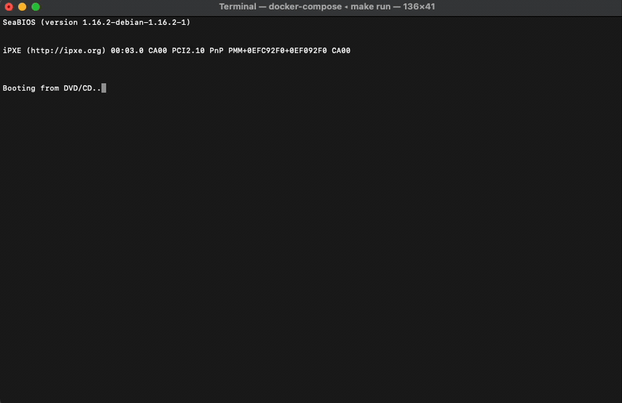
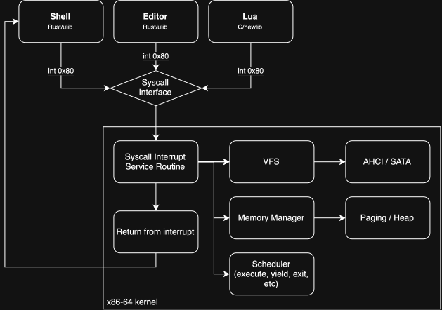

# Bubble OS

Bubble OS is a monolithic operating system for x86-64 written primarily in Rust.

The project began as an exploration of kernel development and gradually grew into a kernel hosting a small userspace environment. Bubble OS now boots through GRUB, discovers and initializes hardware, mounts a writable FAT32 filesystem, runs isolated Ring 3 processes, and exposes a Unix-like syscall interface.

A port of newlib provides a C standard library on top of those interfaces, which is sufficient to run an unmodified build of Lua 5.4.7 with dynamic memory, floating-point operations, file I/O, environment variables, time functions, and process execution.



### Architecture

Bubble OS uses a monolithic kernel architecture, with userspace programs interacting with kernel services through an `int 0x80` syscall interface.

At boot, the kernel initializes paging, the heap, descriptor tables, interrupts, the PIT and RTC, ACPI and PCI discovery, AHCI storage, and the FAT32 filesystem. It then loads the userspace shell as an ELF executable, creates an isolated address space for it, and hands execution over to the scheduler.

Userspace processes each have their own page table, stack, heap, environment, working directory, file descriptor table, and saved CPU/FPU state. The kernel uses a preemptive round-robin scheduler driven by the PIT and switches between processes by saving their execution state and changing address spaces.

The filesystem is exposed through a VFS abstraction layer with `Directory` and `File` interfaces, so the syscall layer is independent of FAT32 itself. FAT32 currently sits on top of the AHCI/SATA driver and supports both reading and modification, including file creation, directories, deletion, truncation, renaming, seeking, and VFAT long filenames.

The resulting stack looks roughly like this:



### Implemented Subsystems

 - **Processes and memory:** isolated Ring 3 address spaces, ELF loading, preemptive scheduling, process heaps, FPU/SSE context switching, fault isolation.
 - **Storage and filesystems:** DMA-backed AHCI/SATA, filesystem-independent VFS, writable FAT32, VFAT LFNs, directories/rename/truncate/seeking.
 - **Userspace:** `int 0x80` syscall interface, per-process FD tables/cwd/environment, Rust ulib, newlib C environment, shell/editor/utilities.
 - **Arch/platform:** GRUB/long mode, GDT/TSS, IDT/exceptions, ACPI/PCI, PIT/RTC, serial console.
 - **Networking:** experimental e1000 network interface card driver with receive support (currently disabled).

### Userspace

 - **ulib** provides Rust wrappers around the raw syscall interface.
 - **newlib** is ported as Bubble's C standard library. A syscall bridge implements the operating-system hooks expected by newlib. This allows conventional C programs to use functionality such as: `malloc`/`realloc`/`free` through `sbrk`, stdio, `libm`, `system()`, and more.
 - **lua** is built from its upstream source without modifications and linked against the newlib port. Getting Lua running serves as an integration test across much of the OS, including process execution, memory management, FPU state, file I/O, the C library, and the filesystem.
 - **shell** provides an interactive command-line environment with built-in filesystem utilities and `PATH`-based execution of userspace programs.
 - Utilities such as `ls`, `cat`, `edit`, `statinfo`.
 - Several lower-level test programs verify subsystems such as FPU switching, the heap, and fault handling.

### Building and Running

The build environment is Docker-based so that the kernel, cross toolchain, newlib, disk image, and ISO can be built reproducibly without depending on the host system's toolchain.

Build the image once, then build and boot:

```sh
make image          # builds the container, ~20 min cold (binutils + GCC from source)
make build_and_run  # userspace, disk image, kernel, ISO, then QEMU
```

Other targets:

```sh
make full_build     # build everything without running
make kernel         # kernel only
make userspace      # userspace programs, including the libc and Lua
make run            # boot the last build
make clean
```

QEMU runs headless on the serial console; `Ctrl-A X` exits.

To debug, run `make debug_run` in one terminal, which waits before the first instruction, then `make gdb` in another to attach to the stub on port 1234.

### Limitations and Future Work

Bubble OS is still an experimental operating system rather than a general-purpose Unix implementation. Notable current limitations include:

 - Single processor only
 - No `fork`
 - No signals, pipes, or descriptor duplication
 - No demand paging or swap
 - No dynamic linking, all programs are statically linked
 - No users, permissions, or ownership model
 - No network protocol stack or transmit path
 - Directory renames can't move directories to a different parent

The next major focus is networking, with longer-term plans for a package manager and a hosted repository of software ported to Bubble OS. Further out, the plan is to experiment with Intel VT-x virtualization. Hypervisor support is a future goal and is not currently implemented.